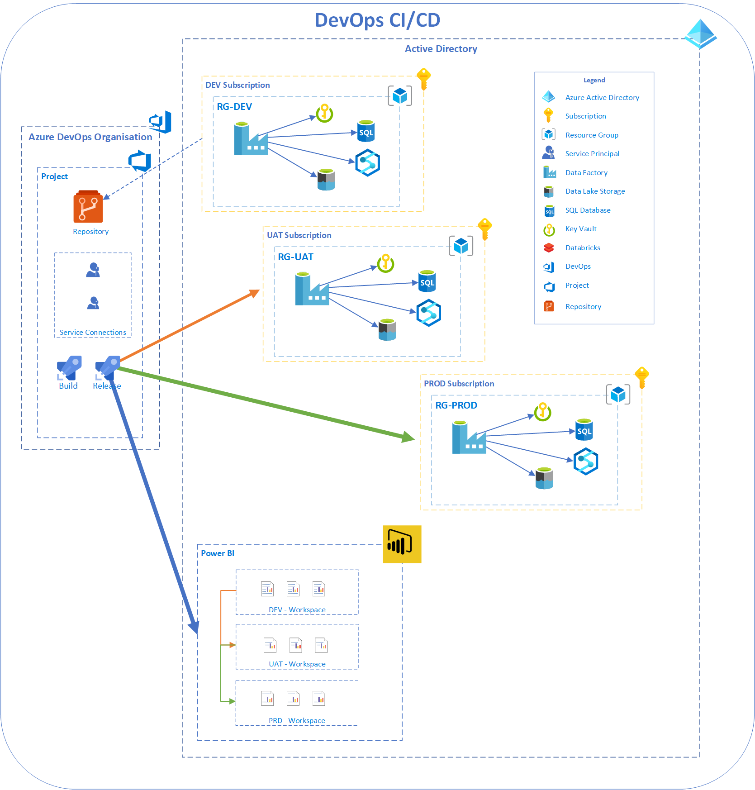

# Introduction

The Antares Modern Data Platform is a metadata driven framework which allows developers to simplify configuration of source system ingestion which allows developers investing more time in data engineering and report writing. The MDP framework is a standardized ingestion engine which follows best practices when adopting a modern data platform over a data lake.  

For testing the MDP framework you will need:  

1. [Active Azure Subscription](https://azure.microsoft.com/en-au/).  
2. [Azure DevOps Account](https://azure.microsoft.com/en-au/solutions/devops/).
3. [Wide World Importers sample database](https://github.com/Microsoft/sql-server-samples/releases/tag/wide-world-importers-v1.0) (for demonstration purposes).

**Note:** If you have created a *Free* Azure DevOps account, you will need to raise a request to Microsoft for a Free Tier License for Parallel Jobs. See link [Azure DevOps Parallelism Request](https://forms.office.com/pages/responsepage.aspx?id=v4j5cvGGr0GRqy180BHbR63mUWPlq7NEsFZhkyH8jChUMlM3QzdDMFZOMkVBWU5BWFM3SDI2QlRBSC4u).

The MDP Framework uses three zones to separate the data:  

* Raw - The unprocessed or incremental state of data received from the source.
* Trusted - Takes the raw data and forms a single historic view and leverages Delta storage format.
* Curated - This is a subset of the trusted data which forms more meaningful representation of data for presentation.

Currently, **Azure DevOps** is required for the deployment of the framework. Grouping of resources for the MDP framework are required to be created for:  

* DEV - for Development
* UAT - for UAT testing
* PROD - for Production Deployment

We have also provided a [checklist](./Documentations/MDP%20Framework%20Checklist.docx) where your system administrators can fill out in order to deploy the Azure DevOps pipeline correctly.

## Naming Conventions

Although this is not mandatory, proper naming convention will manage your resources in azure. The convention to follow is:  

> [resource_type]-[resource_name]-[resource_number]

## Prerequisite For Azure Resource Deployment

There are some prerequisite that is required before deployment, these are:  

1. [Creating the resource groups](./Documentations/Creating%20the%20resource%20groups.md).
2. [Registering resource providers (namespaces) against your subscription](./Documentations/Registering%20resource%20providers%20(namespaces)%20against%20your%20subscription.md).
3. [Creating an Enterprise Application Entry in Active Directory and Service Principal Creation](./Documentations/Creating%20Service%20Principal%20For%20Azure%20DevOps.md).
4. [Create a Databricks Service Principal](./Documentations/Create%20a%20Databricks%20Service%20Principal.md).
5. [Creating a project in Azure DevOps](./Documentations/Creating%20a%20project%20in%20Azure%20DevOps.md).

## Deployment of Azure Resources

Once the perquisites are met, the next step is deployment.  

1. [Creating a release and deploying Azure Resources from Azure DevOps](./Documentations/Creating%20a%20release%20and%20deploying%20Azure%20Resources%20from%20Azure%20DevOps.md).

## Post Requisites of Azure Resources

Once the Azure resources are created, there are two post requisite tasks to be completed before setting up the your data sources ingestion.

1. [Creating a Secret-Scope in Databricks](./Documentations/Create%20a%20Secret-Scope%20in%20Databricks.md).
2. [Add Storage Blob Data Contributor RBAC role to resource group](./Documentations/Add%20Storage%20Blob%20Data%20Contributor%20RBAC%20role%20to%20Resource%20Group.md).
3. [Configure Git Configuration & Add Global Parameters in Azure Data Factory](./Documentations/Configure%20Git%20Configuration%20%26%20Add%20Global%20Parameters%20in%20Azure%20Data%20Factory.md)
4. [Link Azure DevOps repo to Databricks](./Documentations/Link%20Azure%20DevOps%20repo%20to%20Databricks.md).
5. [Create database per container in Databricks](./Documentations/Create%20database%20per%20container%20in%20Databricks.md).
6. [Adding data source entry and generated for data ingestion from SQL data source](./Documentations/Adding%20data%20source%20entry%20and%20generated%20for%20data%20ingestion%20from%20sql%20data%20source.md).

## Running the Main Pipeline in Azure Data Factory

Once the perquisite, deployment of azure resources & post requisites are met, executing the main pipeline will do the orchestration of ingesting data from your defined data sources and egressing the data out to the data lake.

To get data into the data lake:

1. [Execute the main pipeline](./Documentations/Execute%20the%20main%20pipeline.md).  
2. [Creating notebooks and ADF for Curated Pipeline](./Documentations/Creating%20notebooks%20and%20ADF%20for%20Curated%20Pipeline.md).
3. [Enabling the Curated Pipeline for Curated Pipeline for Execution in ADF](./Documentations/Enabling%20the%20Curated%20Pipeline%20for%20Curated%20Pipeline%20for%20Execution%20in%20ADF.md)